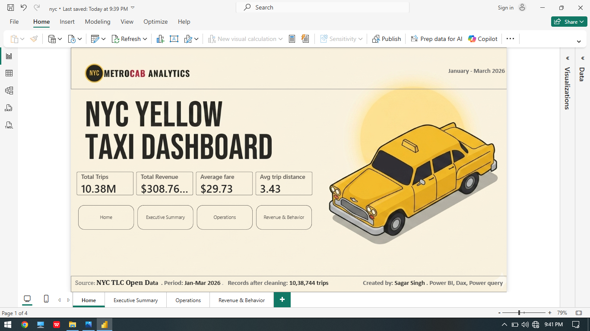
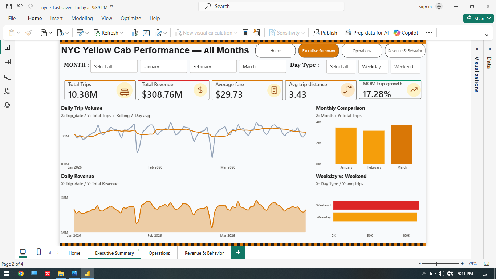
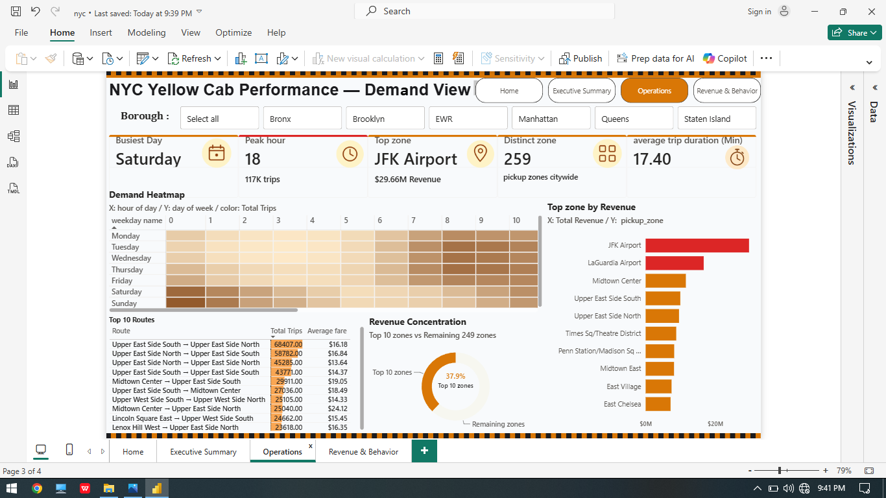
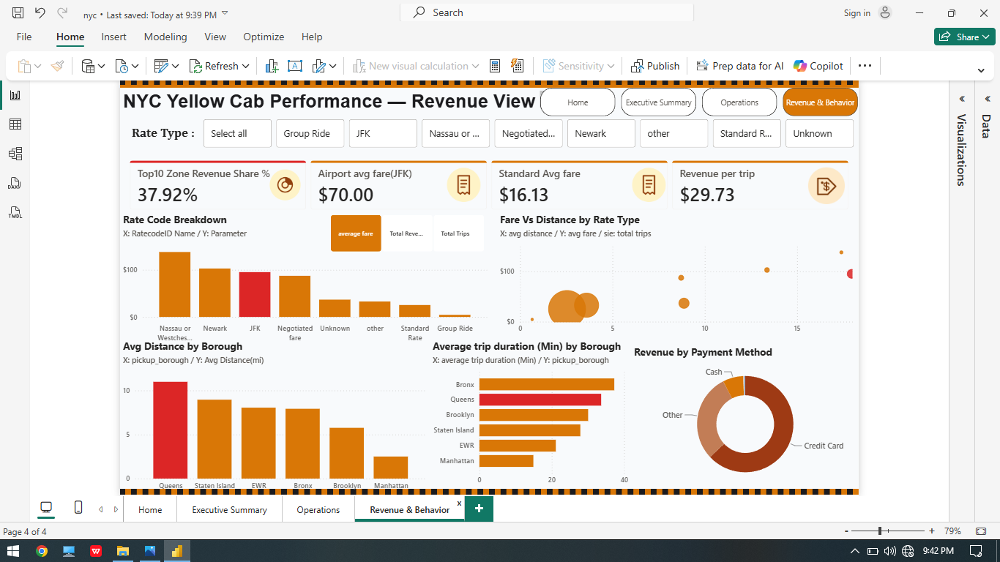

# NYC Yellow Taxi Performance Analytics
### End-to-End Data Pipeline | Statistical Inference | Demand Forecasting | BI Dashboard

**Author:** Sagar Singh
**Period Covered:** January – March 2026
**Stack:** MySQL 8.0 → Python (pandas, statsmodels, scikit-learn) → Power BI

---

## 1. Project Overview

This project turns three months of raw NYC TLC Yellow Taxi trip records into a decision-ready analytics product. It covers the full lifecycle of a real-world analytics engagement:

1. **Data Engineering** — ingesting ~10M+ raw trip records and a taxi zone reference table into MySQL, cleaning and validating them, and modeling them into query-ready views.
2. **SQL Analytics** — twelve production-style business queries covering trends, growth, zone economics, demand patterns, and anomaly detection.
3. **Statistical Analysis** — a hypothesis-testing framework answering six specific business questions with proper assumption checks, effect sizes, and multiple-comparison correction.
4. **Time-Series Forecasting** — an ARIMA/SARIMA model to forecast near-term daily trip volume, with residual diagnostics and a business-facing recommendation.
5. **BI Dashboard** — a 4-page Power BI report (Home, Executive Summary, Operations, Revenue & Behavior) for stakeholder consumption.

**Final dataset after cleaning:** 10,384,737 trips (Jan 1 – Mar 31, 2026).

---

---

## 2. Dataset Details

| Attribute | Detail |
|---|---|
| **Source** | NYC Taxi & Limousine Commission (TLC) Trip Record Data — Yellow Taxi |
| **Reference data** | Official TLC `taxi_zone_lookup.csv` (LocationID → Borough, Zone, Service Zone) |
| **Raw files ingested** | `yellow_tripdata_2026-01.csv`, `yellow_tripdata_2026-02.csv`, `yellow_tripdata_2026-03.csv` |
| **Time period** | January 1, 2026 – March 31, 2026 (90 days) |
| **Raw row count (pre-cleaning)** | ~10.4M+ trips across 3 monthly files |
| **Final row count (post-cleaning)** | 10,384,737 trips |
| **Grain** | One row per taxi trip |
| **Key columns** | `tpep_pickup_datetime`, `tpep_dropoff_datetime`, `passenger_count`, `trip_distance`, `RatecodeID`, `PULocationID`, `DOLocationID`, `payment_type`, `fare_amount`, `tip_amount`, `tolls_amount`, `total_amount`, `congestion_surcharge`, `Airport_fee` |
| **Derived columns** | `trip_month` (YYYY-MM, from pickup datetime), `pickup_borough`/`pickup_zone`, `dropoff_borough`/`dropoff_zone` (joined from zone lookup) |
| **Storage** | MySQL 8.0, loaded via `LOAD DATA LOCAL INFILE`, indexed on `PULocationID`, `DOLocationID`, pickup datetime, and `trip_month` |
| **Cleaning applied** | Removed trips with zero/negative fares, fares exceeding total amount, distances outside 0–100 miles, durations outside 1 min–6 hrs, and unknown zone codes (264, 265) |
| **Data quality checks** | Confirmed 0 of 90 calendar days had missing data; verified no negative `total_amount` values remained post-cleaning |

---

## 3. Business Questions Answered

| # | Question | Method |
|---|----------|--------|
| 1 | Does weekend revenue per trip differ from weekday revenue? | Welch's t-test + Cohen's d |
| 2 | Does tipping % vary by payment method? | Welch's ANOVA + Tukey HSD |
| 3 | Do trip distances vary by pickup borough? | Welch's ANOVA + eta² |
| 4 | Is month-over-month volume growth real or noise? | t-test + Wilcoxon signed-rank |
| 5 | Is fare amount normally distributed? | D'Agostino-Pearson + Anderson-Darling |
| 6 | Does payment preference vary by borough? | Chi-square + Cramér's V |
| 7 | What will daily trip volume look like in the next 14 days? | ARIMA vs SARIMA grid search |

---

## 4. Data Pipeline (MySQL)

- **Source data:** NYC TLC Yellow Taxi trip records (Jan–Mar 2026, loaded as `yellow_trips1/2/3`) and the official `taxi_zone_lookup` reference table.
- **Ingestion:** bulk-loaded via `LOAD DATA LOCAL INFILE`, with `trip_month` derived and indexed alongside `PULocationID`, `DOLocationID`, and pickup datetime for query performance.
- **Cleansing rules applied** (`yellow_trips_clean` view):
  - Trips restricted to the reporting months (Jan–Mar 2026)
  - `fare_amount`, `total_amount` > 0, and `fare_amount ≤ total_amount`
  - `0 < trip_distance < 100` miles
  - Non-negative tips and tolls
  - Trip duration between 1 minute and 6 hours
  - Unknown/N/A zone codes (264, 265) excluded from both pickup and drop-off
- **Modeling:** `yellow_trips_final` view joins cleaned trips to `taxi_zone_lookup` twice (pickup and drop-off) to attach borough and zone names for reporting.
- **Analytics layer:** 12 SQL queries covering daily trend, MoM growth, top revenue zones per month, day×hour demand, tip % by borough/payment, weekday vs weekend, rate code mix, top O-D routes, revenue concentration, rolling 7-day anomaly detection (z-score), payment mix, and zone-level MoM trend.

Full SQL is in [`NYC.sql`](./NYC.sql).

---

## 5. Statistical Findings

| Test | Result | Effect Size | Business Takeaway |
|------|--------|--------------|--------------------|
| Weekday vs Weekend revenue | Significant (p<0.001) | d = 0.077 (negligible) | Weekend fares run ~5% higher per trip, but the difference is too small to justify a differentiated pricing strategy |
| Tip % by payment type | Significant (p<0.001) | η² = 0.034 (small) | Credit card trips tip ~24.9% on average vs ~0% for cash; there's a clear incentive to promote card payments |
| Trip distance by borough | Significant (p<0.001) | η² = 0.366 (large) | Queens trips average ~11 miles vs ~2.5 miles in Manhattan — fleet mix and vehicle allocation should differ by borough |
| Feb vs Mar volume | Not significant after correction | d = -0.46 (small) | Month-over-month volume is statistically stable; plan capacity on a steady baseline |
| Fare amount normality | Non-normal (skew=2.01, kurtosis=5.67) | — | Report fares using the median, not the mean; use non-parametric tests downstream |
| Payment preference by borough | Significant (p<0.001) | Cramér's V = 0.103 (small) | Cash acceptance should be tuned locally by borough rather than standardized citywide |

All six tests were evaluated under a Bonferroni-corrected significance threshold (α = 0.0083), with the Benjamini–Hochberg FDR correction shown alongside for comparison. Five of six tests remained significant after correction.

Full methodology, assumption checks, and code are in [`NYC.ipynb`](./NYC.ipynb).

---

## 6. Key Insights

- **Volume is airport- and Manhattan-heavy.** JFK is the single highest-revenue pickup zone ($29.66M), and the top 10 zones alone account for **37.9% of total revenue** out of 259 active zones — demand is highly concentrated, not evenly spread across the city.
- **Saturday, evening hours drive peak demand.** Saturday is the busiest day and hour 18 (6 PM) is the peak hour, with ~117K trips in that single hour bucket — a clear signal for driver shift scheduling.
- **Borough economics differ structurally, not just by chance.** Manhattan trips are short (~2.5 mi) and frequent; Queens trips are long (~11 mi) and less frequent — this is a large effect (η² = 0.366), meaning fleet type and driver incentives should genuinely differ by borough rather than being city-wide policy.
- **Card payments are both more common and far more lucrative in tips.** Credit card trips tip ~24.9% on average vs effectively 0% for cash — but cash still holds meaningfully in some boroughs, so a blanket "go cashless" push would hurt local demand in those zones (Cramér's V = 0.103).
- **Revenue is stable but volume is forecast to soften.** Feb→Mar volume showed no statistically significant change after correction, yet the ARIMA model forecasts an **~11% pullback** over the next 14 days — the near-term risk is a demand dip, not a demand spike.
- **Fares are right-skewed, not normal** (skew = 2.01) — a small number of high-value trips (e.g. JFK/Newark airport runs at ~$70 avg fare vs ~$16 for standard rides) pull the mean well above the median, so any average-fare KPI without a median alongside it is misleading.
- **Weekend "premium" pricing isn't justified by the data** — the $1.49 weekend vs weekday fare gap is statistically real (p<0.001, huge sample) but practically negligible (Cohen's d = 0.077), a good example of why effect size — not just p-value — has to drive the business decision at this scale.

---

## 7. Functions & Methods Used

**SQL (MySQL 8.0)**
| Category | Functions / Techniques |
|---|---|
| Ingestion | `LOAD DATA LOCAL INFILE`, bulk CSV load with `FIELDS TERMINATED BY`, `IGNORE ROWS` |
| Data prep | `DATE_FORMAT`, `UPDATE ... WHERE`, `CREATE INDEX` on join/filter columns |
| Cleaning | View-based filtering (`CREATE OR REPLACE VIEW`) with range checks, `NOT IN`, `TIMESTAMPDIFF` |
| Joins & modeling | `JOIN` for zone enrichment, `UNION ALL` to stack monthly tables |
| Window functions | `LAG()`, `RANK()`, `AVG() OVER`, `STDDEV() OVER` with `ROWS BETWEEN ... PRECEDING` |
| Aggregation | `GROUP BY`, `COUNT`, `SUM`, `ROUND`, `NULLIF` (safe division) |
| Date logic | `DAYNAME`, `HOUR`, `DAYOFWEEK`, `FIELD()` for custom weekday ordering |
| Export | `INTO OUTFILE` for pushing the cleaned dataset to Python/Power BI |

**Python (pandas, scipy, statsmodels, scikit-learn)**
| Category | Functions / Techniques |
|---|---|
| Hypothesis testing | `scipy.stats.ttest_ind` (Welch's t-test), `stats.wilcoxon`, one-way & Welch's ANOVA, `pairwise_tukeyhsd` |
| Normality checks | `normaltest` (D'Agostino-Pearson), `anderson` (Anderson-Darling), `jarque_bera` |
| Variance checks | `levene`, `bartlett` |
| Association | Chi-square test of independence, Cramér's V (custom calc) |
| Multiple comparisons | `statsmodels.stats.multitest.multipletests` (Bonferroni + FDR/Benjamini-Hochberg) |
| Effect sizes | Cohen's d, eta² (η²), omega² (ω²), Cramér's V — computed alongside every p-value |
| Time series decomposition | `STL` (Seasonal-Trend decomposition using LOESS) |
| Stationarity | `adfuller` (Augmented Dickey-Fuller test) |
| Forecasting | `ARIMA`, `SARIMAX` with grid search over orders selected by AIC |
| Residual diagnostics | `acorr_ljungbox` (autocorrelation), `het_arch` (heteroscedasticity), Jarque-Bera (normality) |
| Forecast evaluation | `mean_absolute_error`, `mean_squared_error`, custom MAPE, 95% confidence intervals |
| Visualization | `matplotlib`, `seaborn` (heatmaps, boxplots, Q-Q plots via `statsmodels.graphics.gofplots.qqplot`, ACF plots via `plot_acf`) |

**Power BI**
DAX measures for KPI cards and MoM growth %, Power Query for data shaping, page-level and report-level slicers (Month, Day Type, Borough, Rate Type), and matrix/heatmap visuals for the day×hour demand grid.

---

## 8. Future Improvements

- **Extend the time window.** Three months limits the forecasting model's ability to learn yearly seasonality (holidays, weather, summer/winter demand swings); a 12–24 month history would allow a proper SARIMA seasonal model or Prophet-style yearly seasonality component instead of relying on a 7-day cycle.
- **Add weather and event data.** Joining in NOAA weather data and NYC event calendars (concerts, holidays, marathons) would likely explain a meaningful share of the daily anomalies flagged by the z-score detector, and could be added as exogenous regressors (SARIMAX) to improve MAPE beyond the current 8.76%.
- **Automate the pipeline.** Replace the manual `LOAD DATA LOCAL INFILE` + hardcoded Windows paths with a scheduled ETL (Airflow, or even a simple Python script + cron) that pulls the latest TLC month automatically, so the dashboard refreshes without manual re-runs.
- **Move from MySQL to a cloud warehouse.** At 10M+ rows/quarter, a column-store warehouse (BigQuery, Snowflake, or Redshift) would scale better for ad hoc analytical queries and remove the local `secure_file_priv` / local-infile friction seen in this build.
- **Model tip behavior directly.** A regression or gradient-boosted model predicting tip % from trip distance, borough, payment type, and time-of-day could turn "tips vary by payment type" into an actionable, driver-facing tipping-likelihood score.
- **Validate the ARIMA winner further.** Current selection is based on a single 14-day holdout; adding rolling-origin (walk-forward) cross-validation would give a more robust MAPE estimate and reduce the risk of the result being specific to that particular test window.
- **Include green taxis and FHV (Uber/Lyft) data.** Yellow cabs are one part of NYC's for-hire vehicle market; bringing in green taxi and high-volume FHV trip records would let the analysis speak to city-wide mobility trends rather than just the yellow-cab segment.
- **Operationalize the anomaly detector.** Wire the 7-day rolling z-score query into an alerting layer (e.g. a scheduled query + Slack/email webhook) so operations is notified of demand anomalies same-day rather than discovering them in a retrospective report.

---

## 9. Demand Forecast

- **Approach:** STL decomposition to isolate trend/seasonality, ADF test for stationarity, followed by an ARIMA vs SARIMA grid search selected by AIC, validated on a 14-day out-of-sample holdout.
- **Winning model:** ARIMA(2,1,3) — MAE ≈ 10,017 trips/day, RMSE ≈ 12,150 trips/day, **MAPE ≈ 8.76%**, outperforming the best seasonal SARIMA(0,1,1)(7) model (MAPE ≈ 13.1%).
- **Diagnostics:** residuals pass the Ljung-Box (white noise) and ARCH (no heteroscedasticity) tests, confirming the model captures the available structure in the series.
- **Forecast:** average of ~127,400 trips/day over the forecast horizon (±60,500 at 95% CI), representing an estimated **11% decline** versus the recent baseline.
- **Recommendation:** plan for a moderate volume pullback — consider fleet-size flexibility or targeted rider promotions rather than assuming flat demand.

---

## 10. Power BI Dashboard

A 4-page interactive report built on the cleaned SQL output, designed for both executive and operational audiences.

**Headline metrics (Jan–Mar 2026):** 10.38M trips · $308.76M revenue · $29.73 average fare · 3.43 mile average trip distance.

### Home
Landing page with the top-line KPIs and navigation to the three analytical pages.

### Executive Summary
Daily trip volume with a 7-day rolling average, daily revenue trend, month-over-month trip comparison, and a weekday vs weekend split — filterable by month and day type.

### Operations (Demand View)
Day × hour demand heatmap, top 10 pickup→drop-off routes, top revenue zones, and revenue concentration analysis — filterable by borough.

### Revenue & Behavior
Rate code breakdown, fare vs distance by rate type, average trip duration and distance by borough, and revenue split by payment method — filterable by rate type.

---

## 11. Repository Contents

| File | Description |
|------|-------------|
| `NYC.sql` | Full MySQL pipeline — schema, ingestion, cleaning, views, and 12 analytical queries |
| `NYC.ipynb` | Python notebook — hypothesis testing framework, demand forecasting, diagnostic dashboard |
| `screenshots/` | Power BI dashboard page exports referenced in this README |
| `README.md` | This file |

---

## 12. Tools & Techniques

`MySQL 8.0` · `Python (pandas, numpy, scipy, statsmodels, scikit-learn)` · `Power BI (DAX, Power Query)` · Welch's t-test/ANOVA · Tukey HSD · Chi-square/Cramér's V · Bonferroni & FDR correction · STL decomposition · ARIMA/SARIMA · Residual diagnostics (Ljung-Box, Jarque-Bera, ARCH)

---

## 13. Key Business Recommendations

1. **Pricing:** no need for weekend-specific pricing — the effect on revenue per trip is negligible.
2. **Payments:** actively promote credit card adoption; negotiate processing costs given the tipping upside, while preserving cash options in boroughs where it's preferred.
3. **Fleet allocation:** position larger vehicles/longer-range supply in Queens; concentrate short-trip capacity in Manhattan.
4. **Capacity planning:** treat month-over-month volume as stable in the short term, but plan for an ~11% forecasted decline over the next two weeks and adjust fleet size or promotions accordingly.
5. **Reporting standards:** use median (not mean) fare in dashboards and executive reporting given the strong right-skew in fare distribution.

---

**Prepared by: Sagar Singh**
